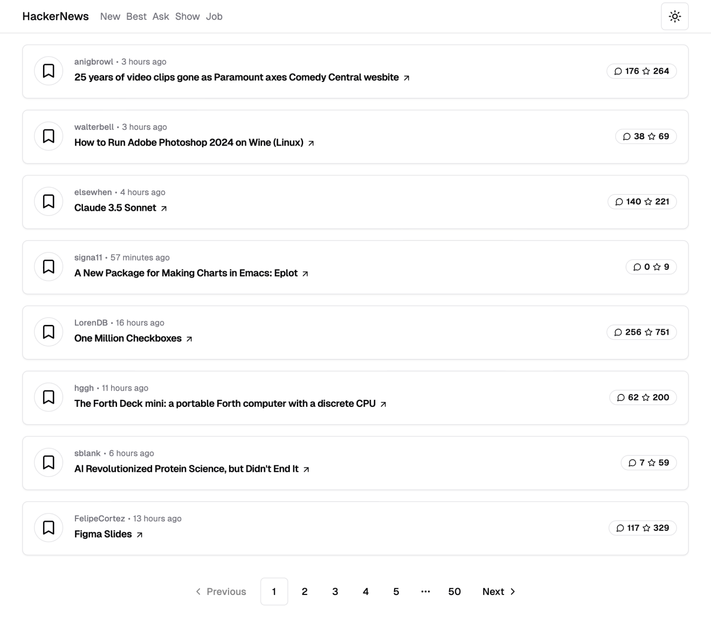

# Hacker News Clone

This project is a clone of Hacker News built with [Next.js](https://nextjs.org/), [TypeScript](https://www.typescriptlang.org/), [Tailwind CSS](https://tailwindcss.com/), and [shadcn/ui](https://github.com/shadcn/ui). It provides a platform where popular news and articles are listed, and users can vote and comment on them.

## Screenshot



## Features

- List of news and articles
- User pages
- News detail pages and comments
- Responsive design
- Fast and modern user interface
- Dark mode

## Installation

Clone the repository:

```bash
git clone https://github.com/oktay/hackernews.git
cd hackernews
```

Install the dependencies:

```bash
npm install
```

## Starting the Development Server

To start the development server:

```bash
npm run dev
```

Open [http://localhost:3000](http://localhost:3000) with your browser to see the result. The page will automatically reload if you make changes to the code.

## Building for Production

To build the application for production:

```bash
npm run build
```

This command will create an optimized build in the `.next` folder.

## Technologies Used

- [Next.js](https://nextjs.org/) - React framework
- [TypeScript](https://www.typescriptlang.org/) - Typed superset of JavaScript
- [Tailwind CSS](https://tailwindcss.com/) - Utility-first CSS framework
- [shadcn/ui](https://github.com/shadcn/ui) - UI components library

## Contributing

If you would like to contribute, please open a pull request or submit an issue. Contributions and feedback are welcome.

## License

This project is licensed under the MIT License. See the `LICENSE` file for more information.
